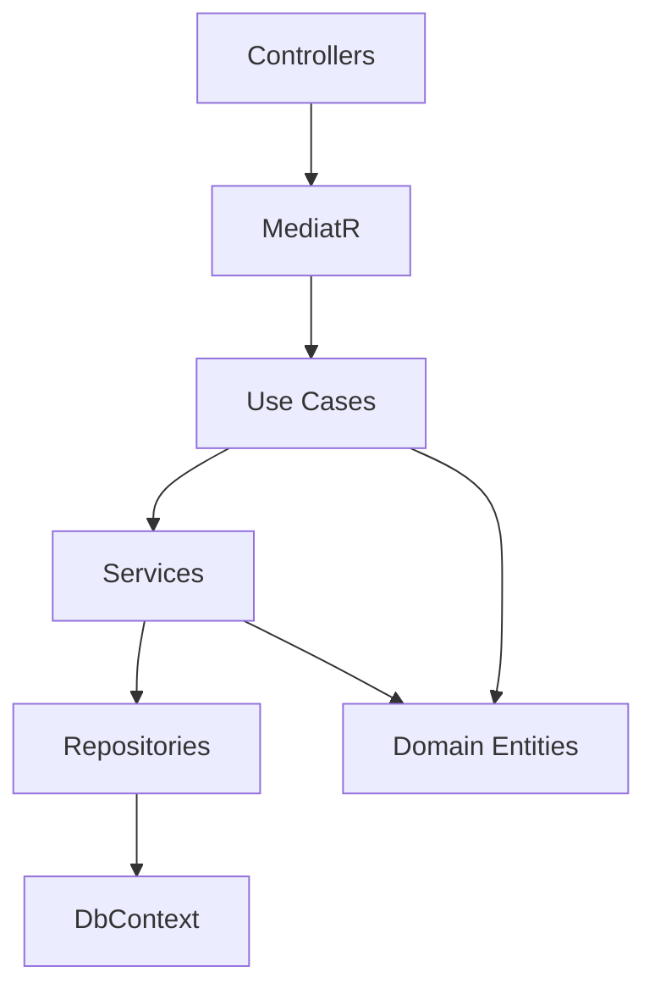
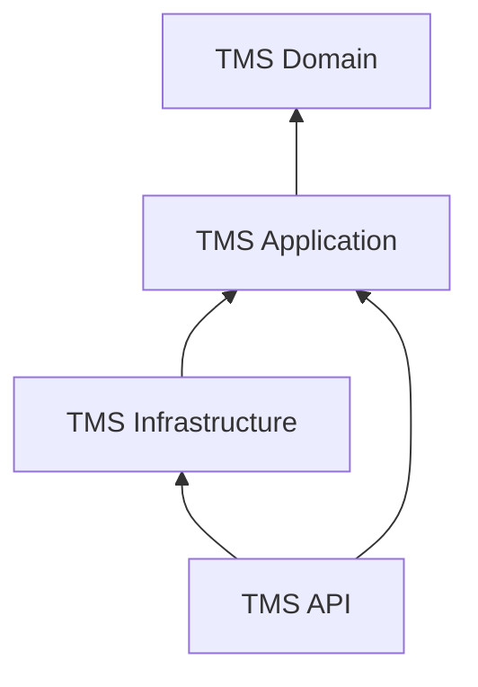
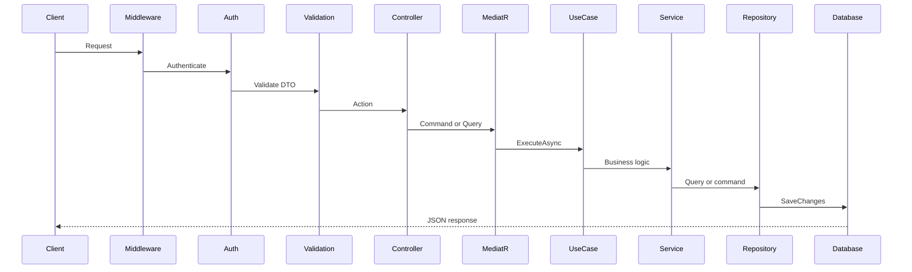
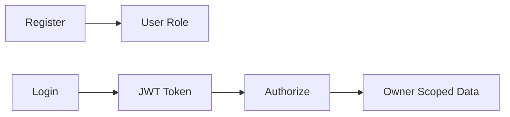
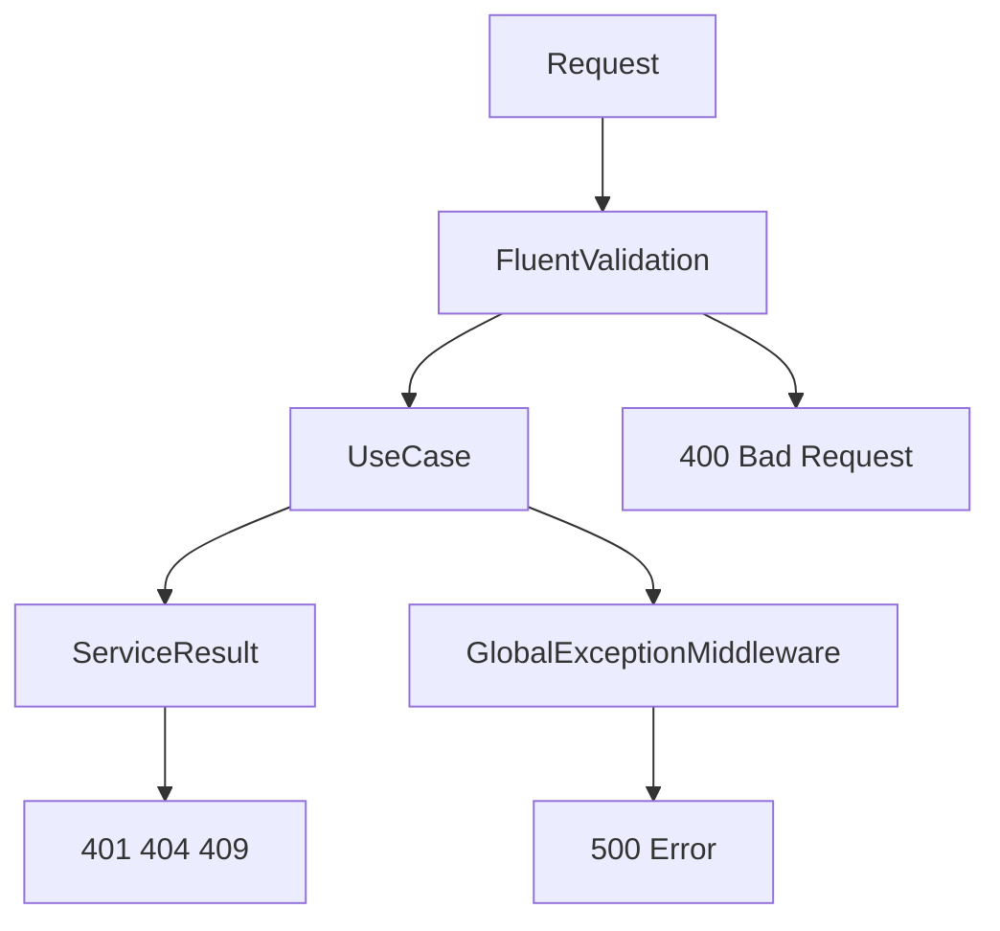
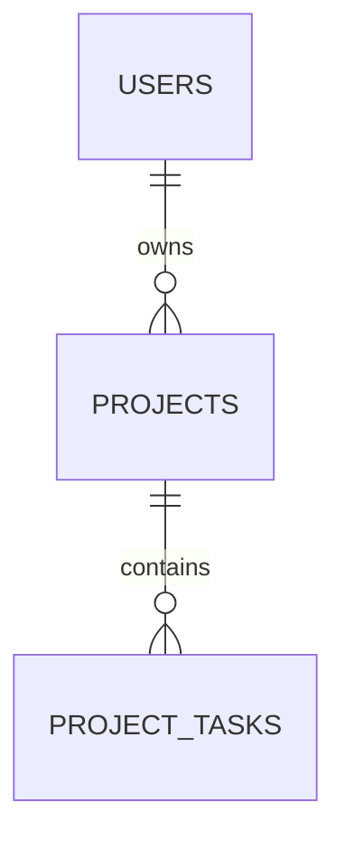

# TMS — Task Management System

A .NET 9 Web API for managing projects and tasks with JWT authentication, clean architecture, and owner-scoped data isolation. Each authenticated user can create and manage only their own projects and the tasks within those projects.

---

## Table of Contents

1. [Technology Stack](#technology-stack)
2. [Solution Structure](#solution-structure)
3. [Clean Architecture](#clean-architecture)
4. [Project Dependencies](#project-dependencies)
5. [Request Pipeline](#request-pipeline)
6. [CQRS and MediatR](#cqrs-and-mediatr)
7. [Use Cases and Layering](#use-cases-and-layering)
8. [Generic Repository and Service](#generic-repository-and-service)
9. [ServiceResult and ApiResponse](#serviceresult-and-apiresponse)
10. [Naming Conventions](#naming-conventions)
11. [API Design](#api-design)
12. [API Versioning](#api-versioning)
13. [Endpoint Reference](#endpoint-reference)
14. [Authentication and Role-Based Authorization](#authentication-and-role-based-authorization)
15. [Error Handling](#error-handling)
16. [Database Design](#database-design)
17. [Maintainability](#maintainability)
18. [Getting Started](#getting-started)
19. [Contact](#contact)

---

## Technology Stack

| Category | Technology |
|----------|------------|
| Runtime | .NET 9 |
| Web framework | ASP.NET Core Web API |
| ORM | Entity Framework Core 9 |
| Database | SQL Server |
| Mediator | MediatR |
| Validation | FluentValidation |
| Mapping | AutoMapper |
| Authentication | JWT Bearer (ASP.NET Core Identity) |
| API documentation | Swashbuckle (Swagger) |
| API versioning | Asp.Versioning.Mvc 8.1 |

---

## Solution Structure

| Project | Role |
|---------|------|
| `TMS.Domain` | Entities, enums, domain methods, `AppRoles` |
| `TMS.Application` | Use cases, MediatR, DTOs, validators, service contracts |
| `TMS.Infrastruture` | EF Core, repositories, migrations *(folder typo; namespace is `TMS.Infrastructure`)* |
| `TMS.API` | Controllers, middleware, JWT, Swagger |

**Dependency rule:** Domain → Application → Infrastructure → API (inward only). Use cases call services; services call repositories.

---

## Clean Architecture

The solution follows **Clean Architecture** . Dependencies point inward: outer layers depend on inner layers, never the reverse.

### Dependency Rule

- **Domain** has zero dependencies on other projects.
- **Application** defines interfaces (`IProjectRepository`, `IProjectService`, etc.) and use cases; it does not reference EF Core or ASP.NET Core.
- **Infrastructure** implements Application interfaces (repositories, DbContext).
- **API** wires everything together via DI, handles HTTP concerns only.

Business rules live in **Domain** (e.g. `Project.Create`, `Task.ChangeStatus`, `SoftDelete`). Application use cases orchestrate; they do not contain persistence logic.

---

## Project Dependencies

---

## Request Pipeline

Every HTTP request flows through the following stages:

Pipeline: `GlobalExceptionMiddleware` → JWT auth → `FluentValidationFilter` → Controller → MediatR → Use case → Service → Repository → `ApiResponse.FromResult`.

---

## CQRS and MediatR

Commands (writes) and queries (reads) live under `TMS.Application/Features/{Feature}/`. Each file has one message + one handler that delegates to a use case.

Features: **Project** (CRUD + paged list), **Task** (create, list by project, update status, delete), **Authentication** (login, register, refresh token).

---

## Use Cases and Layering

Use cases in `TMS.Application/UseCases/{Feature}/` expose `ExecuteAsync` → `ServiceResult<T>`.

**Rule:** Use case → Service → Repository (use cases never inject repositories or `UserManager`).

**Data isolation:** Projects scoped by `OwnerId`; tasks validated via `Task.Project.OwnerId` using `ICurrentUserService`.

---

## Generic Repository and Service

`IGenericRepository<T>` and `IGenericService<T>` provide standard CRUD and paging. Feature-specific interfaces add owner-scoped lookups (`GetByIdAndOwnerAsync`, `GetByProjectIdAndOwnerAsync`, etc.) on `Project`, `Task`, and `User`.

---

## ServiceResult and ApiResponse

Application layer returns `ServiceResult<T>` (success, status code, message, data). Controllers map it to `ApiResponse<T>` via `ApiResponse.FromResult`. Factory helpers cover 200, 201, 400, 401, 403, 404, 409, and 500. Paginated lists use `PagedResult` with `items`, `pageNumber`, `pageSize`, and page metadata.

---

## Naming Conventions

`I{Action}{Entity}UseCase` / `{Action}{Entity}UseCase`, `I{Entity}Service`, `I{Entity}Repository`, `{Action}{Entity}Command`, `Get{...}Query`, `{Action}{Entity}Request`, `{Entity}Response`, `{Dto}Validator`, `{Entity}Configuration`, `{Entity}Profile`.

One file per use case, validator, and MediatR handler. DTOs grouped under `DTOs/{Feature}/`.

---

## API Design

Thin controllers dispatch MediatR and return `ApiResponse`. Resources: `Auth`, `Projects`, `Tasks`. Deletes are soft (`SoftDelete()` + `UpdateAsync`). Swagger documents all endpoints with JWT Bearer support.

---

## API Versioning

URL segment versioning via `Asp.Versioning.Mvc`. Default `v1`, route template `api/v{version:apiVersion}/[controller]` on `ApiControllerBase`. Swagger generates one document per version.

---

## Endpoint Reference

Base: `/api/v1/`. Full request/response schemas are in Swagger.

### Auth (no token required)

| Method | Path |
|--------|------|
| `POST` | `/Auth/login` |
| `POST` | `/Auth/register` |
| `POST` | `/Auth/refresh-token` |

### Projects (`[Authorize]`)

| Method | Path |
|--------|------|
| `GET` | `/Projects` *(query: `pageNumber`, `pageSize`)* |
| `GET` | `/Projects/{id}` |
| `POST` | `/Projects` |
| `PUT` | `/Projects/{id}` |
| `DELETE` | `/Projects/{id}` |

### Tasks (`[Authorize]`)

| Method | Path |
|--------|------|
| `POST` | `/Tasks` |
| `GET` | `/Tasks/project/{projectId}` |
| `PATCH` | `/Tasks/{id}/status` |
| `DELETE` | `/Tasks/{id}` |

---

## Authentication and Role-Based Authorization

### JWT and roles

JWT Bearer auth configured in `Program.cs` (`jwt` section in `appsettings.json`). Seeded roles: `Admin`, `User` (new registrations get `User`). Protected controllers use `[Authorize]`; data isolation is via `OwnerId`, not role policies yet.

**Swagger:** Login → copy `token` → Authorize → `Bearer <token>`.

---

## Error Handling

Errors are handled at three layers:

**Layers:** FluentValidation → 400 on invalid input; `ServiceResult` → 401/404/409 for expected failures; `GlobalExceptionMiddleware` → 500 in production (developer page in Development).

---

## Database Design

**Tables:** ASP.NET Identity, `Projects` (owner FK), `Tasks` (cascade from project). All entities inherit `BaseEntity` (audit + soft delete).

**Migrations:** `dotnet ef database update --project TMS.Infrastruture --startup-project TMS.API`

Connection string: `ConnectionStrings:TMS` in `appsettings.json`.

---

## Maintainability

One file per use case, validator, and command. Interface-based DI, domain factory methods, `ServiceResult` for explicit failures, generic repo/service with feature extensions, CQRS folders, API versioning, soft delete, and AutoMapper `ConstructUsing` for record DTOs.

**New feature:** Domain → EF/migration → DTOs + validators → repository/service → use cases → MediatR → DI → controller → Swagger.

---

## Getting Started

**Prerequisites:** .NET 9 SDK, SQL Server, Visual Studio / VS Code / Rider.

1. Set `ConnectionStrings:TMS` in `appsettings.json`.
2. `dotnet ef database update --project TMS.Infrastruture --startup-project TMS.API`
3. `dotnet run --project TMS.API` → Swagger at `/swagger`
4. Register → Authorize with Bearer token → test Projects and Tasks endpoints.

**Build tip:** Stop TMS.API / IIS Express if you get DLL lock (`MSB3027`) errors.

---

## Contact

**Ahmed Mahmoud** — [LinkedIn](https://www.linkedin.com/in/ahmed-mahmoud-951a5716b/) · [Ahmedmah1284@gmail.com](mailto:Ahmedmah1284@gmail.com) · +20 1028207883

---

## License

This project is part of the ElectroPi assessment task.
