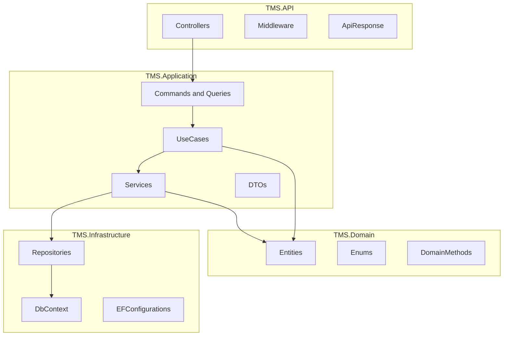
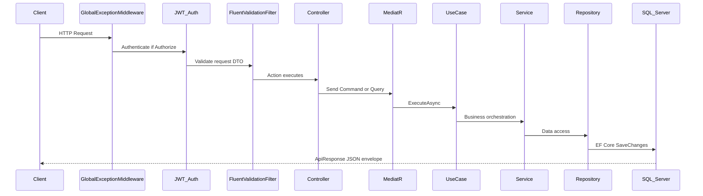
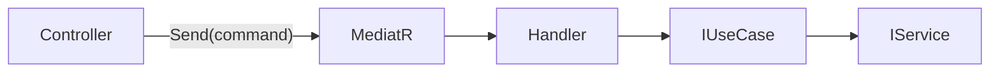
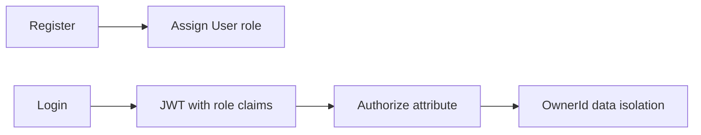
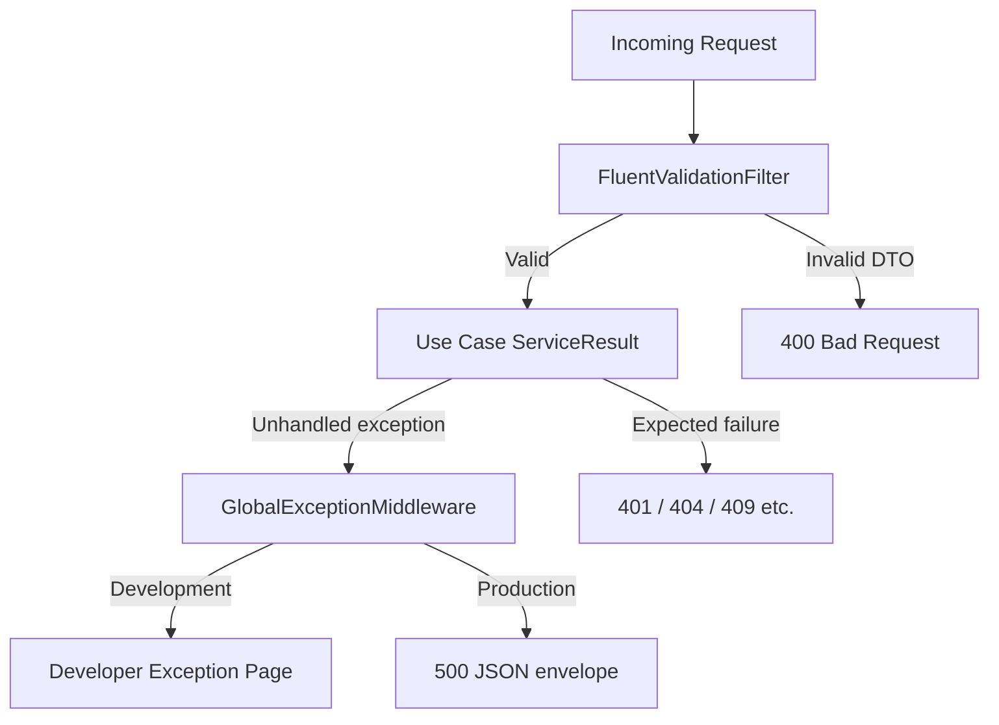
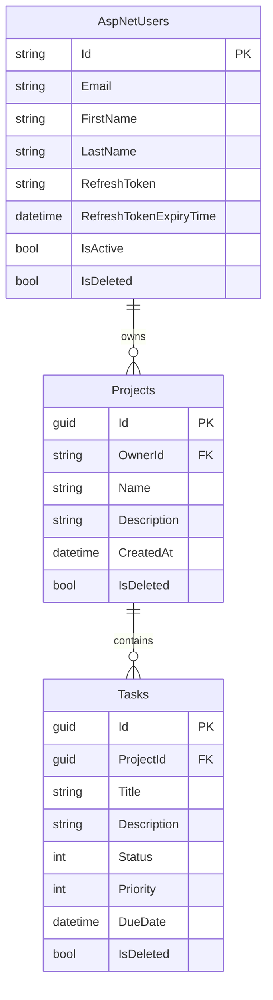

# TMS — Task Management System

A .NET 9 Web API for managing projects and tasks with JWT authentication, clean architecture, and owner-scoped data isolation. Each authenticated user can create and manage only their own projects and the tasks within those projects.

---

## Table of Contents

1. [Technology Stack](#technology-stack)
2. [Solution Structure](#solution-structure)
3. [Clean Architecture](#clean-architecture)
4. [Project Dependencies](#project-dependencies)
5. [Request Pipeline](#request-pipeline)
6. [CQRS and MediatR](#cqrs-and-mediatr)
7. [Use Cases and Layering](#use-cases-and-layering)
8. [Generic Repository and Service](#generic-repository-and-service)
9. [ServiceResult and ApiResponse](#serviceresult-and-apiresponse)
10. [Naming Conventions](#naming-conventions)
11. [API Design](#api-design)
12. [API Versioning](#api-versioning)
13. [Endpoint Reference](#endpoint-reference)
14. [Authentication and Role-Based Authorization](#authentication-and-role-based-authorization)
15. [Error Handling](#error-handling)
16. [Database Design](#database-design)
17. [Maintainability](#maintainability)
18. [Getting Started](#getting-started)
19. [Contact](#contact)

---

## Technology Stack

| Category | Technology |
|----------|------------|
| Runtime | .NET 9 |
| Web framework | ASP.NET Core Web API |
| ORM | Entity Framework Core 9 |
| Database | SQL Server |
| Mediator | MediatR |
| Validation | FluentValidation |
| Mapping | AutoMapper |
| Authentication | JWT Bearer (ASP.NET Core Identity) |
| API documentation | Swashbuckle (Swagger) |
| API versioning | Asp.Versioning.Mvc 8.1 |

---

## Solution Structure

| Project | Key folders | Role |
|---------|-------------|------|
| `TMS.Domain` | `Entities/`, `Enums/`, `Constants/` | Domain entities, factory methods, `AppRoles` |
| `TMS.Application` | `DTOs/`, `Features/`, `UseCases/`, `Services/`, `Validators/`, `Interfaces/` | Use cases, MediatR, validation, service contracts |
| `TMS.Infrastruture` | `Repositories/`, `Configurations/`, `Migrations/`, `Data/` | EF Core, repository implementations |
| `TMS.API` | `Controllers/`, `Common/`, `Swagger/`, `Program.cs` | HTTP API, middleware, JWT, Swagger |

### Layer Responsibilities

| Layer | Project | Responsibility | May reference |
|-------|---------|----------------|---------------|
| Domain | `TMS.Domain` | Entities, enums, domain factory methods, invariants | Nothing |
| Application | `TMS.Application` | Use cases, DTOs, interfaces, MediatR, validation rules | Domain |
| Infrastructure | `TMS.Infrastructure` | EF Core, repositories, Identity, migrations | Application, Domain |
| Presentation | `TMS.API` | Controllers, middleware, JWT wiring, Swagger | Application, Infrastructure |

> **Note:** The physical folder is named `TMS.Infrastruture` (typo), but the .NET namespace and project assembly use `TMS.Infrastructure`.

---

## Clean Architecture

The solution follows **Clean Architecture** (also called Onion Architecture). Dependencies point inward: outer layers depend on inner layers, never the reverse.

### Dependency Rule

- **Domain** has zero dependencies on other projects.
- **Application** defines interfaces (`IProjectRepository`, `IProjectService`, etc.) and use cases; it does not reference EF Core or ASP.NET Core.
- **Infrastructure** implements Application interfaces (repositories, DbContext).
- **API** wires everything together via DI, handles HTTP concerns only.

Business rules live in **Domain** (e.g. `Project.Create`, `Task.ChangeStatus`, `SoftDelete`). Application use cases orchestrate; they do not contain persistence logic.

---

## Project Dependencies

---

## Request Pipeline

Every HTTP request flows through the following stages:

| Stage | Component | File |
|-------|-----------|------|
| Exception safety net | `GlobalExceptionMiddleware` | `TMS.API/Common/Middlewares/GlobalExceptionMiddleware.cs` |
| Input validation | `FluentValidationFilter` | `TMS.API/Common/Filters/FluentValidationFilter.cs` |
| Authentication | JWT Bearer middleware | `TMS.API/Program.cs` |
| Dispatch | MediatR | `TMS.Application/Features/` |
| Response shaping | `ApiResponse.FromResult` | `TMS.API/Common/ApiResponse/ApiResponse.cs` |

---

## CQRS and MediatR

The application uses a **CQRS-style** separation between commands (writes) and queries (reads), implemented with **MediatR**.

| Type | Purpose | Location |
|------|---------|----------|
| **Command** | Create, update, delete | `TMS.Application/Features/{Feature}/Commands/` |
| **Query** | Read operations | `TMS.Application/Features/{Feature}/Queries/` |

Each file contains **one record** (the message) and **one handler** (the processor). Handlers are thin: they inject the matching use case interface and call `ExecuteAsync`.

### Feature folder layout

| Feature | Commands | Queries |
|---------|----------|---------|
| Project | Create, Update, Delete | GetById, GetPaged |
| Task | Create, UpdateStatus, Delete | GetByProject |
| Authentication | Login, Register, RefreshToken | — |

Authentication handlers use the `Features/Handlers/Authentication/Commands/` path; Project and Task follow the `Features/{Feature}/Commands|Queries/` convention.

Each handler injects an `I*UseCase` and calls `ExecuteAsync` — see `CreateProjectCommand.cs` in `Features/Project/Commands/` for the pattern.

---

## Use Cases and Layering

Use cases live in `TMS.Application/UseCases/{Feature}/` with **one interface and one class per file**.

| Feature | Use cases |
|---------|-----------|
| Authentication | `LoginUseCase`, `RegisterUserUseCase`, `RefreshTokenUseCase` |
| Project | `CreateProjectUseCase`, `GetProjectsPagedUseCase`, `GetProjectByIdUseCase`, `UpdateProjectUseCase`, `DeleteProjectUseCase` |
| Task | `CreateTaskUseCase`, `GetTasksByProjectUseCase`, `UpdateTaskStatusUseCase`, `DeleteTaskUseCase` |

### Layering rule (enforced in code)

**Use Case → Service → Repository → Database**

- Use cases depend on **service interfaces only** (`IProjectService`, `ITaskService`, `IUserService`, `IAuthService`).
- Services depend on **repository interfaces** (`IProjectRepository`, `ITaskRepository`, etc.).
- Use cases **never** inject repositories or `UserManager` directly.

### Use case contract

Every use case exposes a single `ExecuteAsync(...)` method returning `ServiceResult<T>` (for example, `ICreateProjectUseCase.ExecuteAsync(CreateProjectRequest)`).

### Data isolation

Projects are scoped by `OwnerId` (the authenticated user's Identity ID). Tasks have no direct owner FK; access is validated by joining through `Task.Project.OwnerId`. `ICurrentUserService` reads the user ID from the JWT `NameIdentifier` claim.

---

## Generic Repository and Service

### IGenericRepository&lt;T&gt;

Defined in `TMS.Application/Interfaces/Repositories/Generic/IGenericRepository.cs`. Provides:

| Method | Description |
|--------|-------------|
| `GetAllAsync` | Untracked queryable |
| `GetAllWithIncludeAsync` | With eager-loading |
| `GetByIdAsync` | Single entity by GUID |
| `GetByIdWithIncludeAsync` | Single entity with includes |
| `AddAsync` | Insert |
| `UpdateAsync` | Update tracked entity |
| `DeleteAsync` | Hard delete by ID |
| `IsExistAsync` | Existence check |
| `GetAllPagedAsync` | Paginated list with optional filter and includes |

Implemented by `GenericRepository<T>` in `TMS.Infrastruture/Repositories/Generic/GenericRepository.cs`.

### IGenericService&lt;T&gt;

Defined in `TMS.Application/Interfaces/Services/Generic/IGenericService.cs`. Wraps repository calls and returns `ServiceResult<T>` for every operation. Implemented by `GenericService<T>`.

### Feature-specific extensions

| Interface | Extra methods |
|-----------|---------------|
| `IProjectRepository` / `IProjectService` | `GetByIdAndOwnerAsync`, `GetTrackedByIdAndOwnerAsync` |
| `ITaskRepository` / `ITaskService` | `GetByIdAndOwnerAsync`, `GetTrackedByIdAndOwnerAsync`, `GetByProjectIdAndOwnerAsync` |
| `IUserRepository` / `IUserService` | `GetByEmailAsync`, `CheckPasswordAsync`, `RegisterAsync` |

Feature services (`ProjectService`, `TaskService`) inherit `GenericService<T>` and add owner-scoped methods that return `ServiceResult.NotFound` when the entity is missing or not owned by the current user.

---

## ServiceResult and ApiResponse

The solution uses a **dual-wrapper pattern**: application logic returns `ServiceResult<T>`; the API layer maps it to `ApiResponse<T>` for HTTP responses.

### ServiceResult&lt;T&gt; (Application layer)

Location: `TMS.Application/Common/Results/ServiceResult.cs`

| Property | Type | Description |
|----------|------|-------------|
| `Success` | `bool` | Whether the operation succeeded |
| `StatusCode` | `HttpStatusCode` | Intended HTTP status |
| `Messages` | `string` | Human-readable message |
| `Data` | `T?` | Payload on success |

**Factory methods:**

| Method | HTTP Status | When to use |
|--------|-------------|-------------|
| `Ok(data)` | 200 | Successful read or update |
| `Created(data)` | 201 | Resource created |
| `BadRequest(message)` | 400 | Validation or business rule failure |
| `Unauthorized(message)` | 401 | Missing or invalid credentials |
| `Forbidden(message)` | 403 | Authenticated but not permitted |
| `NotFound(message)` | 404 | Resource not found |
| `Conflict(message)` | 409 | Duplicate resource (e.g. email exists) |
| `Failure(message)` | 500 | Unexpected server error |

### ApiResponse&lt;T&gt; (API layer)

Location: `TMS.API/Common/ApiResponse/ApiResponse.cs`

Controllers map results through `ApiResponse.FromResult(controller, serviceResult)`, which sets the HTTP status code and wraps the payload in a consistent JSON envelope.

### Response envelope

All API responses share the same shape:

| Field | Type | Description |
|-------|------|-------------|
| `success` | `bool` | Operation outcome |
| `messages` | `string` | Human-readable message |
| `data` | `T` or `null` | Payload on success |
| `statusCode` | `number` | HTTP status code |

Paginated project lists return `data` as a `PagedResult` with `items`, `pageNumber`, `pageSize`, `totalRecords`, `totalPages`, `hasPreviousPage`, and `hasNextPage`.

---

## Naming Conventions

| Area | Convention | Example |
|------|------------|---------|
| Solution projects | `TMS.{Layer}` | `TMS.Application` |
| Controllers | `{Entity}Controller` | `ProjectsController` |
| Base controller | `ApiControllerBase` | Shared versioning + route |
| Use case interface | `I{Action}{Entity}UseCase` | `ICreateProjectUseCase` |
| Use case class | `{Action}{Entity}UseCase` | `CreateProjectUseCase` |
| Service interface | `I{Entity}Service` | `IProjectService` |
| Repository interface | `I{Entity}Repository` | `ITaskRepository` |
| Command record | `{Action}{Entity}Command` | `DeleteTaskCommand` |
| Query record | `Get{...}Query` | `GetTasksByProjectQuery` |
| Request DTO | `{Action}{Entity}Request` | `CreateTaskRequest` |
| Response DTO | `{Entity}Response` | `TaskResponse` |
| Validator | `{Dto}Validator` | `CreateProjectRequestValidator` |
| EF configuration | `{Entity}Configuration` | `ProjectConfiguration` |
| AutoMapper profile | `{Entity}Profile` | `TaskProfile` |
| DI extension | `Add{Layer}Service` | `AddApplicationService` |

**File organization rules:**

- One use case per file.
- One validator per file.
- One MediatR command/query + handler per file.
- DTOs grouped by feature in `DTOs/{Feature}/`.

---

## API Design

### Principles

- **Thin controllers** — no business logic; only MediatR dispatch and `ApiResponse.FromResult`.
- **Resource-oriented URLs** — controllers map to entities (`Auth`, `Projects`, `Tasks`).
- **Soft delete** — `DELETE` endpoints call domain `SoftDelete()` and persist via `UpdateAsync`; rows are not physically removed.
- **Owner-scoped data** — users only see and mutate their own projects and tasks.
- **Swagger annotations** — `[SwaggerOperation]`, `[SwaggerTag]` on all endpoints.
- **JWT in Swagger** — Bearer token can be set in the Swagger UI Authorize dialog.

### HTTP methods used

| Method | Usage |
|--------|-------|
| `GET` | Read (list, get by id) |
| `POST` | Create, login, register |
| `PUT` | Full update (projects) |
| `PATCH` | Partial update (task status) |
| `DELETE` | Soft delete |

---

## API Versioning

Versioning uses **URL segment** strategy via `Asp.Versioning.Mvc`.

### Configuration (`TMS.API/Program.cs`)

- Default version: `1.0`
- `AssumeDefaultVersionWhenUnspecified = true`
- `ReportApiVersions = true` (response header lists supported versions)
- `UrlSegmentApiVersionReader` — version read from URL path

### Controller base (`ApiControllerBase`)

All controllers inherit `ApiControllerBase`, which applies `[ApiVersion("1.0")]`, route template `api/v{version:apiVersion}/[controller]`, and `[ApiController]`. Current routes resolve to `/api/v1/{controller}/...`.

### Swagger

`ConfigureSwaggerOptions` generates a separate OpenAPI document per API version. Swagger UI lists each version (e.g. **TMS API V1**).

Unversioned routes such as `/api/Projects` **do not work** — clients must include the version segment.

---

## Endpoint Reference

Base URL (development): `https://localhost:44378` or as configured in launch settings.

All versioned routes use the prefix `/api/v1/`.

### Authentication — `AuthController`

No authentication required.

| Method | Path | Description | Request body | Response |
|--------|------|-------------|--------------|----------|
| `POST` | `/api/v1/Auth/login` | Authenticate user | `LoginRequest` | `AuthResponse` |
| `POST` | `/api/v1/Auth/register` | Register new user | `RegisterRequest` | `AuthResponse` |
| `POST` | `/api/v1/Auth/refresh-token` | Refresh JWT tokens | `RefreshTokenRequest` | `AuthResponse` |

**DTO fields**

| DTO | Fields |
|-----|--------|
| `LoginRequest` | `email`, `password` |
| `RegisterRequest` | `email`, `firstName`, `lastName`, `password` |
| `RefreshTokenRequest` | `accessToken`, `refreshToken` |
| `AuthResponse` | `token`, `refreshToken`, `accessTokenExpiration`, `refreshTokenExpiration`, `user` (`AuthenticatedUserDto`) |

---

### Projects — `ProjectsController`

Requires `Authorization: Bearer <token>`.

| Method | Path | Description | Request | Response |
|--------|------|-------------|---------|----------|
| `GET` | `/api/v1/Projects` | Paginated list (owner-scoped) | Query: `pageNumber`, `pageSize` | `PagedResult<ProjectResponse>` |
| `GET` | `/api/v1/Projects/{id}` | Get project by ID | — | `ProjectResponse` |
| `POST` | `/api/v1/Projects` | Create project | `CreateProjectRequest` | `ProjectResponse` (201) |
| `PUT` | `/api/v1/Projects/{id}` | Update project | `UpdateProjectRequest` | `ProjectResponse` |
| `DELETE` | `/api/v1/Projects/{id}` | Soft-delete project | — | `ProjectResponse` |

**DTO fields**

| DTO | Fields |
|-----|--------|
| `CreateProjectRequest` / `UpdateProjectRequest` | `name`, `description` (optional) |
| `GetProjectsPagedRequest` (query) | `pageNumber` (default 1), `pageSize` (default 10, max 100) |
| `ProjectResponse` | `id`, `name`, `description`, `createdAt`, `updatedAt`, `taskCount` |

---

### Tasks — `TasksController`

Requires `Authorization: Bearer <token>`.

| Method | Path | Description | Request | Response |
|--------|------|-------------|---------|----------|
| `POST` | `/api/v1/Tasks` | Create task in owned project | `CreateTaskRequest` | `TaskResponse` (201) |
| `GET` | `/api/v1/Tasks/project/{projectId}` | List tasks by project | — | `IReadOnlyList<TaskResponse>` |
| `PATCH` | `/api/v1/Tasks/{id}/status` | Update task status only | `UpdateTaskStatusRequest` | `TaskResponse` |
| `DELETE` | `/api/v1/Tasks/{id}` | Soft-delete task | — | `TaskResponse` |

**DTO fields**

| DTO | Fields |
|-----|--------|
| `CreateTaskRequest` | `projectId`, `title`, `description` (optional), `status` (default Todo), `dueDate` (optional), `priority` (default Medium) |
| `UpdateTaskStatusRequest` | `status` |
| `TaskResponse` | `id`, `projectId`, `title`, `description`, `status`, `dueDate`, `priority`, `createdAt`, `updatedAt` |

**TaskStatus**

| Value | Name |
|-------|------|
| 0 | Todo |
| 1 | InProgress |
| 2 | Done |
| 3 | Cancelled |

#### TaskPriority enum

| Value | Name |
|-------|------|
| 0 | Low |
| 1 | Medium |
| 2 | High |
| 3 | Critical |

---

## Authentication and Role-Based Authorization

### JWT authentication

- Scheme: `Bearer` (JWT)
- Configured in `TMS.API/Program.cs` with issuer, audience, and signing key from `appsettings.json` (`jwt` section).
- Access token lifetime: configurable via `jwt:accessTokenExpirationMinutes` (default 100 minutes).
- Refresh token lifetime: `jwt:refreshTokenExpirationDays` (default 7 days).
- `AuthService.BuildAuthResponseAsync` generates tokens and persists the refresh token on the user entity.

### Roles

| Role | Seeded | Assigned on register |
|------|--------|----------------------|
| `Admin` | Yes (EF `HasData`) | No |
| `User` | Yes (EF `HasData`) | Yes |

Roles are defined in `TMS.Domain/Constants/AppRoles.cs` and seeded via `IdentityRoleConfiguration`.

JWT tokens include `ClaimTypes.Role` for each role. `AuthenticatedUserDto` returns roles in the login/register response.

### Current authorization model

| Mechanism | Applied where | Purpose |
|-----------|---------------|---------|
| `[Authorize]` | `ProjectsController`, `TasksController` | Require valid JWT |
| `Project.OwnerId` | All project/task use cases | Per-user data isolation |
| `ICurrentUserService` | Use cases | Read current user ID from JWT |

**Important:** Endpoints do not currently use `[Authorize(Roles = "Admin")]`. Role infrastructure (seeded roles, JWT role claims) is in place for future admin-only features. Today, authorization is **authentication + owner-scoped data access**.

### Using Swagger with JWT

1. Call `POST /api/v1/Auth/login` or `register`.
2. Copy the `token` from the response.
3. Click **Authorize** in Swagger UI.
4. Enter: `Bearer <your-token>`.
5. Call protected endpoints.

---

## Error Handling

Errors are handled at three layers:

### 1. FluentValidationFilter (input validation)

- Runs **before** the controller action.
- Resolves `IValidator<T>` for each action argument from DI.
- On failure: returns `400 Bad Request` with validation error messages.
- Validators live in `TMS.Application/Validators/{Feature}/` — one file per DTO.

### 2. ServiceResult (expected business failures)

Use cases return typed results instead of throwing for expected cases:

| Scenario | Result |
|----------|--------|
| Not logged in | `Unauthorized` (401) |
| Project/task not found or not owned | `NotFound` (404) |
| Email already registered | `Conflict` (409) |
| Domain/service failure | `BadRequest` (400) |

### 3. GlobalExceptionMiddleware (unexpected exceptions)

- Registered early in the pipeline.
- **Development:** re-throws so `UseDeveloperExceptionPage` shows details.
- **Production:** catches unhandled exceptions, maps common types (`UnauthorizedAccessException`, `ArgumentException`, `KeyNotFoundException`) to `ServiceResult`, returns JSON with camelCase properties.

---

## Database Design

### Tables

| Table | Description |
|-------|-------------|
| ASP.NET Identity tables | `AspNetUsers`, `AspNetRoles`, `AspNetUserRoles`, etc. |
| `Projects` | User-owned project containers |
| `Tasks` | Tasks belonging to a project |

### BaseEntity (shared audit model)

All domain entities inherit from `BaseEntity`:

| Field | Purpose |
|-------|---------|
| `Id` | GUID primary key |
| `CreatedAt`, `CreatedBy` | Creation audit |
| `UpdatedAt`, `UpdatedBy` | Last update audit |
| `IsDeleted`, `DeletedAt`, `DeletedBy` | Soft delete |

### Relationships and delete behavior

| Relationship | FK | On delete |
|--------------|-----|-----------|
| `Project.Owner` → `ApplicationUser` | `OwnerId` | `Restrict` |
| `Task.Project` → `Project` | `ProjectId` | `Cascade` |

### EF Core configurations

Fluent API configurations in `TMS.Infrastruture/Configurations/`:

- `ProjectConfiguration` — owner FK, task collection with field-backed navigation
- `TaskConfiguration` — title/description length, status/priority required
- `ApplicationUserConfiguration` — custom user fields
- `IdentityRoleConfiguration` — seeds `Admin` and `User` roles

### Migrations

| Migration | Purpose |
|-----------|---------|
| `20260625231135_Init` | Identity + Projects + Tasks schema |
| `20260626005715_SeedRoles` | Seed Admin and User roles |
| `20260626112536_AddProjectOwnerId` | Add `OwnerId` FK on Projects |

### Connection string

Set `ConnectionStrings:TMS` in `TMS.API/appsettings.json` (default: local SQL Server, database name `TMS`, Windows authentication).

Apply migrations:

`dotnet ef database update --project TMS.Infrastruture --startup-project TMS.API`

---

## Maintainability

Design choices that keep the codebase easy to extend:

| Practice | Benefit |
|----------|-----------|
| **One file per use case, validator, command** | Small, focused units; easy code review |
| **Interface-based DI** | Swap implementations; testable |
| **Domain factory methods** | Business invariants in one place (`Project.Create`, `Task.Create`) |
| **ServiceResult pattern** | Explicit success/failure without exceptions for expected cases |
| **Generic repository/service** | Reuse CRUD; extend only where needed (owner-scoped queries) |
| **CQRS folder structure** | Clear separation of reads and writes |
| **API versioning** | Add v2 controllers/actions without breaking v1 clients |
| **Swagger per version** | Accurate docs as API evolves |
| **Soft delete** | Recoverable data; audit trail preserved |
| **AutoMapper ConstructUsing** | Reliable mapping for positional record DTOs |

### Adding a new feature (checklist)

1. Add or extend domain entity in `TMS.Domain`.
2. Add EF configuration and migration if schema changes.
3. Add DTOs in `TMS.Application/DTOs/{Feature}/`.
4. Add validators (one file per request DTO).
5. Add repository interface + implementation if custom queries needed.
6. Add service interface + implementation.
7. Add use cases (one file per operation).
8. Add MediatR commands/queries under `Features/{Feature}/`.
9. Register services and use cases in `DependencyInjection.cs`.
10. Add controller inheriting `ApiControllerBase`.
11. Verify in Swagger under `/api/v1/`.

---

## Getting Started

### Prerequisites

- [.NET 9 SDK](https://dotnet.microsoft.com/download)
- SQL Server (LocalDB or full instance)
- IDE: Visual Studio 2022+ or VS Code / Rider

### Setup

1. Clone the repository and open the solution in your IDE.
2. Update `ConnectionStrings:TMS` in `TMS.API/appsettings.json` if needed, then run `dotnet ef database update --project TMS.Infrastruture --startup-project TMS.API`.
3. Run the API with `dotnet run --project TMS.API` or F5 in Visual Studio.
4. Open Swagger at `https://localhost:{port}/swagger` (development only).
5. **Test the flow:** register → authorize with Bearer token → create project → create task → list by project → update status → delete.

### Build tip

If you see **"file is locked by TMS.API"** or **MSB3027** errors, stop the running debug session (Shift+F5) or end the `TMS.API` / `iisexpress` process before rebuilding.

---

## Contact

**Project Maintainer:** Ahmed Mahmoud

| | |
|---|---|
| LinkedIn | [ahmed-mahmoud-951a5716b](https://www.linkedin.com/in/ahmed-mahmoud-951a5716b/) |
| Email | [Ahmedmah1284@gmail.com](mailto:Ahmedmah1284@gmail.com) |
| Mobile / WhatsApp | +20 1028207883 |

---

## License

This project is part of the ElectroPi assessment task.
